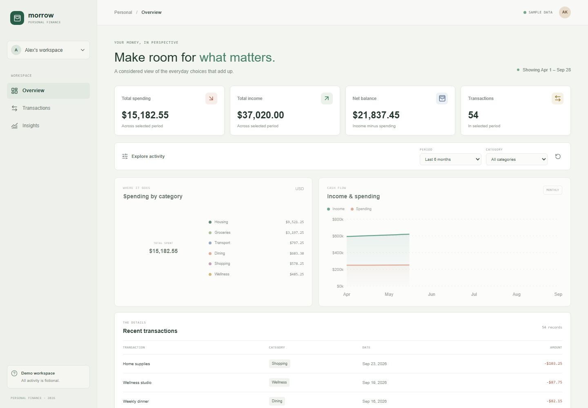

# Personal Finance Dashboard

A recruiter-facing proof of concept built to demonstrate productive, responsible AI-assisted development in a modern React stack. The public dashboard opens without login and uses fictional, read-only data; no backend secrets or personal financial information are involved.

## Demo

Deployment target: Cloudflare Pages Free (`*.pages.dev`). The live URL will be added after the repository is connected to Cloudflare Pages.



## Features

- Four period-based KPIs: spending, income, balance, and transaction count.
- Expense breakdown and monthly income/spending charts.
- Global date-range and category filters shared by every dashboard view.
- Responsive, keyboard-usable desktop and mobile layouts.
- Fictional data generated locally; no authentication, API, or Supabase dependency in Phase 1.

## Stack

React 19, TypeScript strict, Vite, React Router, Tailwind CSS 4, shadcn-style UI primitives, Recharts, Lucide, Vitest, React Testing Library, Playwright, ESLint, Prettier, and GitHub Actions.

Authentication and persistent Supabase transactions are planned for Phase 2. A React Native client is planned for Phase 3.

## Local Development

Requirements: Node.js 24 and npm.

```powershell
npm ci
npm run dev
```

The app is served at `http://localhost:5173` by default.

## Quality Checks

```powershell
npm run format:check
npm run lint
npm run typecheck
npm test
npm run build
npm run test:e2e
```

Playwright requires Chromium. Install it once with `npx playwright install chromium`. The E2E command serves the production build on port 4173.

## Deployment: Cloudflare Pages Free

1. Push this repository to GitHub.
2. In Cloudflare, create a Pages project and connect the GitHub repository.
3. Set the production branch to `main`, build command to `npm run build`, and output directory to `dist`.
4. Deploy and use the generated `pages.dev` hostname; no custom domain or environment variables are required.

Cloudflare account access and repository connection are performed by the project owner. Free-tier quotas and terms can change; see the [Pages limits](https://developers.cloudflare.com/pages/platform/limits/).

## Architecture and Development Notes

- [Architecture](docs/architecture.md)
- [AI-assisted development](docs/ai-assisted-development.md)
- [Phase 1 product spec](agent-os/specs/2026-09-28-1521-phase1-recruiter-demo/plan.md)

## Scope and Data

This is a portfolio PoC, not financial advice or a production banking system. All transaction records and names are fictional. The public Phase 1 demo is read-only. Login, persistent transactions, and Supabase are deferred to Phase 2.# React + TypeScript + Vite

This template provides a minimal setup to get React working in Vite with HMR and some ESLint rules.

Currently, two official plugins are available:

- [@vitejs/plugin-react](https://github.com/vitejs/vite-plugin-react/blob/main/packages/plugin-react) uses [Oxc](https://oxc.rs)
- [@vitejs/plugin-react-swc](https://github.com/vitejs/vite-plugin-react/blob/main/packages/plugin-react-swc) uses [SWC](https://swc.rs/)

## React Compiler

The React Compiler is not enabled on this template because of its impact on dev & build performances. To add it, see [this documentation](https://react.dev/learn/react-compiler/installation).

## Expanding the ESLint configuration

If you are developing a production application, we recommend updating the configuration to enable type-aware lint rules:

```js
export default defineConfig([
  globalIgnores(['dist']),
  {
    files: ['**/*.{ts,tsx}'],
    extends: [
      // Other configs...

      // Remove tseslint.configs.recommended and replace with this
      tseslint.configs.recommendedTypeChecked,
      // Alternatively, use this for stricter rules
      tseslint.configs.strictTypeChecked,
      // Optionally, add this for stylistic rules
      tseslint.configs.stylisticTypeChecked,

      // Other configs...
    ],
    languageOptions: {
      parserOptions: {
        project: ['./tsconfig.node.json', './tsconfig.app.json'],
        tsconfigRootDir: import.meta.dirname,
      },
      // other options...
    },
  },
])

```

You can also install [eslint-plugin-react-x](https://npmx.dev/package/eslint-plugin-react-x) and [eslint-plugin-react-dom](https://npmx.dev/package/eslint-plugin-react-dom) for React-specific lint rules:

```js
// eslint.config.js
import reactX from 'eslint-plugin-react-x'
import reactDom from 'eslint-plugin-react-dom'

export default defineConfig([
  globalIgnores(['dist']),
  {
    files: ['**/*.{ts,tsx}'],
    extends: [
      // Other configs...
      // Enable lint rules for React
      reactX.configs['recommended-typescript'],
      // Enable lint rules for React DOM
      reactDom.configs.recommended,
    ],
    languageOptions: {
      parserOptions: {
        project: ['./tsconfig.node.json', './tsconfig.app.json'],
        tsconfigRootDir: import.meta.dirname,
      },
      // other options...
    },
  },
])

```
